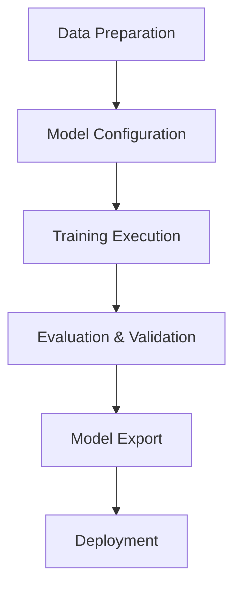

# Model Training Template Guide

## Training Process Standardization


## 1. Unified Training Interface
```python
# Training interface that all models must implement
def train_model(config_path, output_dir):
    """
    Parameters:
        config_path: Training configuration file path
        output_dir: Model output directory
        
    Returns:
        metrics: Training metrics dictionary
        model_path: Exported model path
    """
    # 1. Load configuration
    config = load_config(config_path)
    
    # 2. Prepare data
    dataset = prepare_data(config['data_path'])
    
    # 3. Initialize model
    model = create_model(config['model_type'])
    
    # 4. Training loop
    for epoch in range(config['epochs']):
        loss = train_epoch(model, dataset)
        log_metrics(epoch, loss)
        
    # 5. Validation and evaluation
    metrics = evaluate(model, dataset.val)
    
    # 6. Export model
    model_path = export_model(model, output_dir)
    
    return metrics, model_path
```

## 2. Data Output Specification
```python
# Unified format for model prediction results
{
    "model_id": "A-001",
    "timestamp": "2025-08-09T08:30:00Z",
    "predictions": [
        {
            "input_id": "text_001",
"output": "recognized result text",
            "confidence": 0.95,
            "metadata": {...}
        }
    ],
    "metrics": {
        "inference_time": 0.25,
        "memory_usage": "1.2GB"
    }
}
```

## 3. Training Configuration Example
```yaml
# config/training_config.yaml
model_type: "transformer"
data_path: "./data/training/"
epochs: 100
batch_size: 32
learning_rate: 0.001
optimizer: "adam"
early_stopping: 
  patience: 10
  min_delta: 0.001
output_dir: "./models/B_language/v1/"
```

## 4. Training Monitoring Interface
```python
@app.route('/training_status', methods=['GET'])
def training_status():
"""Returns current training status"""
    return jsonify({
        "status": "running", # running/completed/failed
"progress": 65, # percentage
        "current_epoch": 42,
        "metrics": {
            "loss": 0.15,
            "accuracy": 0.92
        },
        "start_time": "2025-08-09T08:00:00Z",
        "estimated_completion": "2025-08-09T10:30:00Z"
    })
